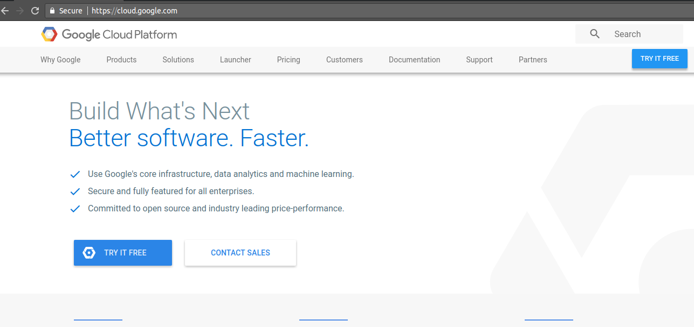
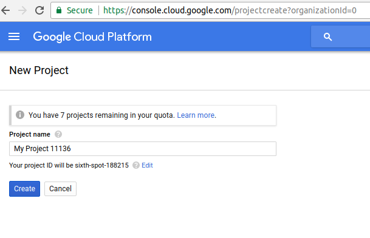
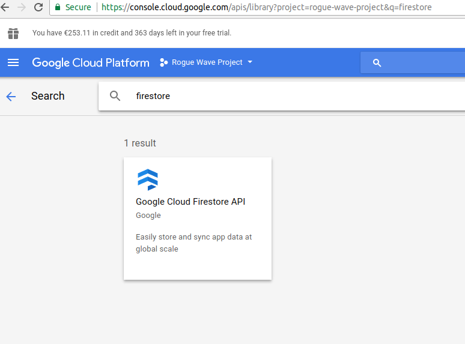
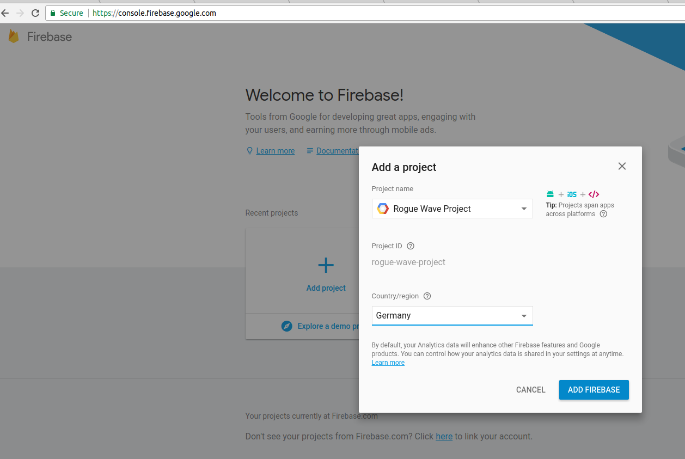
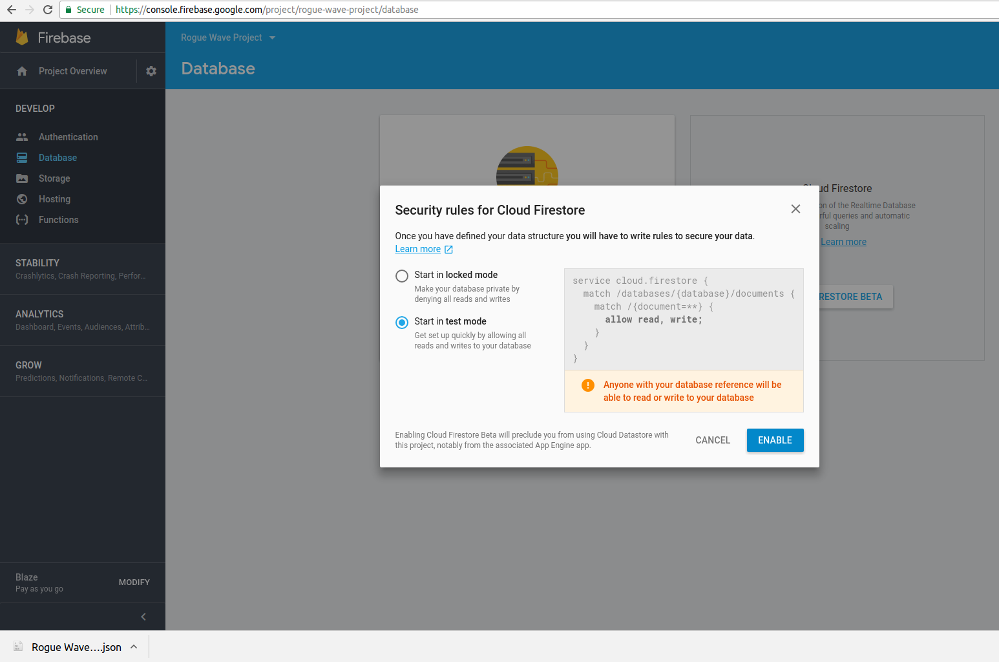
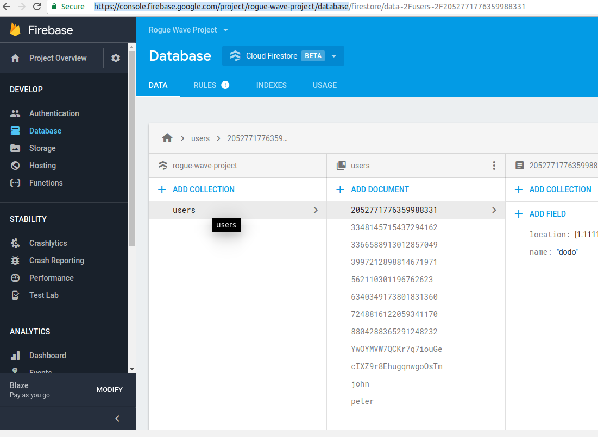
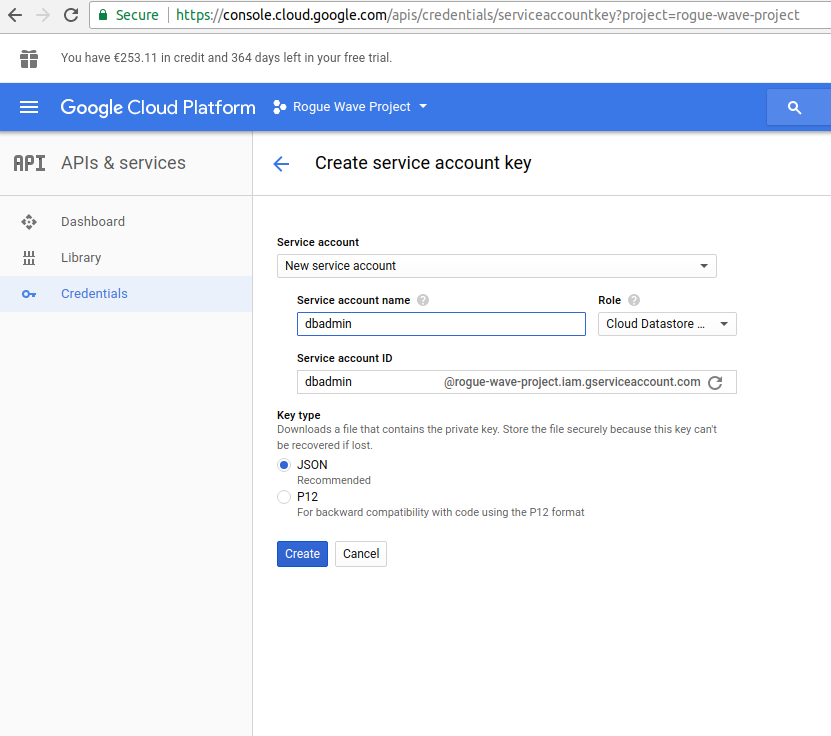

How to use firestore in PHP
===========================

# Account registration and setup

Before you start working with firestore you will need to setup your Google Cloud Account, create a project in it and add the fireStore API to the project. If you have already done that then you can skip that chapter and go directly to [Application](#application).

## Google Cloud Account

If you don’t have a Google Cloud Account you will need to create one. The Usage of FireStore and other Google Cloud services is not free but you can get an initial free trial period.

In order to do so you will have to go to [https://console.cloud.google.com/freetrial](https://console.cloud.google.com/freetrial) and follow the steps. After successful registration you will have a trial Google Cloud account that will be enough to get you started.

## Create a Project

Login into your Google Cloud Account. After successful login go to that URL [https://console.cloud.google.com/projectcreate?organizationId=0](https://console.cloud.google.com/projectcreate?organizationId=0) and enter the name of the project. For this tutorial we will use "Rogue Wave Project". What you will see is how this name is transferred to a **project id** that we will need further when we start coding with PHP.



## Update Libraries and APIS

Add fireStore to the list of libraries and API. To do this go to [https://console.cloud.google.com/apis/library?project=rogue-wave-project](https://console.cloud.google.com/apis/library?project=rogue-wave-project). Make sure to replace "rogue-wave-project" with the project id that you had from the previous step, if your project id is different than that one.

In the search bar enter "firestore" and then add the FireStore API to your library.



## Attach fireStore to your project

FireStore is Google’s real-time powerful NoSQL database. At the time of this writing FireStore is still in Beta phase. In order to use it in your project and store and manipulate data in it you should go to the following URL [https://console.firebase.google.com](https://console.firebase.google.com) and add your project to it. Choose the "Rogue Wave Project" and specify the region that you are interested in. For better results choose a region that is close to your physical location or you are very well connected to it.  

## Create your first FireStore database

Go to [https://console.firebase.google.com/project/rogue-wave-project/database](https://console.firebase.google.com/project/rogue-wave-project/database). This will open an web UI that can help you create your first FireStore database and collections in that database. Make sure also that you set the permissions to "Test Mode" as given below.



Collections are similar in concept to MongoDB collections and SQL tables. For the purposes of this tutorial you should create a collection with the name "users".

Once you have created the collection add documents in it. For the sample applications we will need a document with an id "peter" and fields “name” and “age”. The fields should be having string and number types respectively. Add also a new document that has the name fields have a value of “john”.

After adding several records you should end up with a similar picture.



## Creating a service credentials JSON file

The final and most important part is to create a service account credentials file. This one should be in JSON and our PHP application will use it to read the connection details, setup SSL, and basically provide everything needed to do a normal connection from your local application to the remote Firebase server.

In order to get your JSON file you should go to: [https://console.cloud.google.com/apis/credentials/serviceaccountkey?project=rogue-wave-project](https://console.cloud.google.com/apis/credentials/serviceaccountkey?project=rogue-wave-project)

When you create the JSON file make sure to add a service account name with a "Cloud Datastore" role. As shown below.



# Why gRPC

// TBD

## Overview

// TBD

## Advantages of gRPC

Faster and less CPU intensive

## Short information about proto buffers.

// TBD

## gRPC and PHP

// TBD

## What is FireStore

FireStore is Google’s real-time NoSQL database. It is still in beta and can be tested from the following website:  [https://console.firebase.google.com/project/rogue-wave-project/database](https://console.firebase.google.com/project/rogue-wave-project/database)

## How things work

// TBD

# Application

## Installation

At time of this writing official installation instructions for PHP are missing.

### Credentials Location

Use the following URL [https://cloud.google.com/firestore/docs/quickstart](https://cloud.google.com/firestore/docs/quickstart)  to see how to setup one very important environment variable which should point to the exact location of the JSON file that was created in ["Creating a service credentials JSON file"](#creating-a-service-credentials-json-file).

In your working environment you should setup the environment variable **GOOGLE_APPLICATION_CREDENTIALS** before running the PHP application(s) that need to connect to Firebase/Firestore. You can either do it in the current terminal
```
export GOOGLE_APPLICATION_CREDENTIALS="path/to/your/keyfile.json"
```

Or you can set it in your PHP script using the following code

```
putenv('GOOGLE_APPLICATION_CREDENTIALS='.__DIR__.'/service_credentials.json');
```

**Security notice:**

Please, not that if you put the JSON file in your project it MUST be protected so that only your application has access to it but the external users cannot access it. If a malicious user has access to your JSON file he can do everything that you are also able to do

### gRPC module installation

Follow the documentation from that URL [https://grpc.io/docs/quickstart/php.html](https://grpc.io/docs/quickstart/php.html) to install the grpc PHP module. Also make sure to install the PHP protobuffer module, if you are looking for speed.

### Source code and dependencies

The source code of the application is located in the ```src``` directory.

Once you have the source code locally you need to install the application dependencies. This can be done with the help of **composer.** Composer is the PHP package manager. If you don’t have it already installed on your system, run

```
$ curl -sS https://getcomposer.org/installer | php
$ [sudo] mv composer.phar /usr/local/bin/composer
```

The commands that needs to be run in order to fetch all dependencies are

```
cd <location-of-firebaseapp>
composer install
```

## Configuration

The location of the JSON service key file is specified in the ```config/application.config.php``` file. In it you will find the following line:

```
const CREDENTIALS_FILENAME = __DIR__.'/service_credentials.json';

putenv('GOOGLE_APPLICATION_CREDENTIALS='.CREDENTIALS_FILENAME);
```

The code above expects the JSON file to be present in the ```config/``` folder under the name ```service_credentials.json.``` If that is not the case you have to modify the source code to match the location and name of your JSON file.

### config.php
Please note, that this paragraph is only relevant if you want to run the example application in interactive mode and if it's not started with ```firestore.php```as stated in paragraph [Usage](#usage) below.

In file ```config.php``` are also configuration settings related to the name of the project, database and collection to use. They are defined in the lines:

```
return [
	'firestore' => [
			'options'=> [], // options that will be used for the creation of the FirestoreClient
			'projectId' => 'rogue-wave-project',
      'collectionId' => 'GrpcTestData1',
			'database'  => '(default)',
	]
];
```

Initial ```config.php```can be copied from ```config.php.dist```.

Please modify the configuration according to your settings.

## Usage

There is an interactive and a non-interactive mode available. The entyrpoint for both is running  ```firestore.php``` from the root directory. Please find examples below.

```
Usage:
  firestore --interactive true --databaseid "<DATABASE_ID>" --projectid <PROJECT_ID> --collectionid <COLLECTION_ID> // Interactive mode is started
  firestore --api BatchGetDocuments -x <COMMA_SEPERATED_DOCUMENT_IDS> --databaseid "<DATABASE_ID>" --projectid <PROJECT_ID> --collectionid <COLLECTION_ID>
  firestore --api BeginTransaction --databaseid "<DATABASE_ID>" --projectid <PROJECT_ID>
  firestore --api Commit --databaseid "<DATABASE_ID>" --projectid <PROJECT_ID> --collectionid <COLLECTION_ID>
  firestore --api CreateDocument -x <DOCUMENT_ID> --databaseid <DATABASE_ID> --projectid <PROJECT_ID> --collectionid <COLLECTION_ID>
  firestore --api DeleteDocument -x <DOCUMENT_ID> --databaseid <DATABASE_ID> --projectid <PROJECT_ID> --collectionid <COLLECTION_ID>
  firestore --api GetDocument -x <DOCUMENT_ID> --databaseid <DATABASE_ID> --projectid <PROJECT_ID> --collectionid <COLLECTION_ID>
  firestore --api ListCollectionIds --databaseid <DATABASE_ID> --projectid <PROJECT_ID>
  firestore --api ListDocuments --databaseid "<DATABASE_ID>" --projectid <PROJECT_ID> --collectionid <COLLECTION_ID>
  firestore --api Rollback --databaseid "<DATABASE_ID>" --projectid <PROJECT_ID>
  firestore --api RunQuery --select <SELECT_FIELD> --field=<WHERE_CONDITION_FIELD> --value=<WHERE_CONDITION_VALUE> --databaseid "<DATABASE_ID>" --projectid <PROJECT_ID> --collectionid <COLLECTION_ID>
  firestore --api UpdateDocument -x <DOCUMENT_ID> --field=<FIELD_TO_UPDATE> --value=<VALUE_TO_UPDATE> --databaseid "<DATABASE_ID>" --projectid <PROJECT_ID> --collectionid <COLLECTION_ID>

Options:
  -a, --api=API                    Available Api Calls are:
                                   BatchGetDocuments
                                   BeginTransaction
                                   Commit
                                   CreateDocument
                                   DeleteDocument
                                   GetDocument
                                   ListCollectionIds
                                   ListDocuments
                                   Rollback
                                   RunQuery
                                   UpdateDocument
  -p, --projectid=PROJECTID        Project Id
  -d, --databaseid=DATABASEID      Database Id, e.g. "(default)"
  -c, --collectionid=COLLECTIONID  Collection Id
  -f, --field=FIELD                Field
  -s, --select=SELECT              Select Field, only for RunQuery API
  -i, --interactive[=INTERACTIVE]  Run interactive mode
  -h, --help                       Display this help message
  -val, --value=VALUE              Value
  -x|doc, --documentid=DOCUMENTID  DocumentId
```

The interactive mode can also be started by calling ```php bin/interactive.php```.

## Further development

[https://googlecloudplatform.github.io/google-cloud-php/#/docs/cloud-firestore/master/firestore/v1beta1/firestoreclient](https://googlecloudplatform.github.io/google-cloud-php/#/docs/cloud-firestore/master/firestore/v1beta1/firestoreclient).

Good luck and enjoy working with FireStore!
